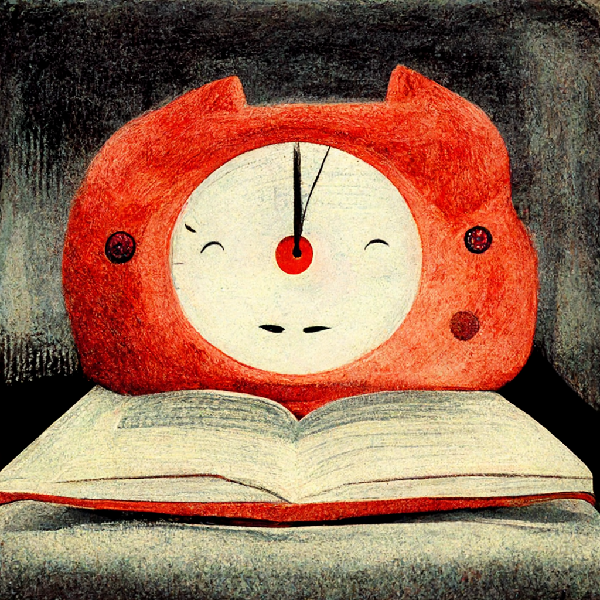

The Pomodoro Technique is very popular study tool. It divides work time in 25-minute intervals, separated by short breaks. Pomodoro was developed by Francesco Cirillo in the 1980s. Originally, the Pomodoro technique employed a kitchen timer. Nowadays, there are many apps and websites providing Pomodoro timers. 

However, some might find a working time of 25 minutes a little bit too short. You might notice that, when the 25 minute bell rings, you have just obtained a deep focus mode, and it might be a little bit of a waste to stop there.  Therefore, a study timer suited to your needs should incorporate variable timer lengths. Make sure to try different work and break time ranges to find out what works for you. 

We have collected the five best alternatives to the simple Pomodoro timer. 

## 1. MicroBreaks.co 
[MicroBreaks.co](https://www.microbreaks.co) provides a science-based study timer. This timer has very short (10 second) mini breaks at random intervals, in addition to a customizable longer study interval. These beginning and end of these micro breaks are signaled by a chime. These breaks have been shown in scientific studies to greatly increase learning capabilities. During these breaks, the brain repeats the learned material at a whopping 10 to 20 times. 
The MicroBreaks study timer has more science-based functionalities, such as a focus exercise prior to the study, and breathing excercises to help you relax. 

## 2. The Flowtime technique
The Flowtime technique is task-based rather than time-based. Before starting, write down the single task you will work on, and write down the time when you start the task. Then, just focus on the work until it is done. After the task, take a little break before doing this again for the next task. Adjust the break duration as wished. 

## 3. The old-fashioned kitchen timer 
The kitchen timer is a great idea for those times when you don't and should not need to open your laptop. If you study with just a book and a kitchen timer, there is less distraction from the internet. In that case, also put the phone away though!

## 4. Youtube study
There are various Youtube "study with me" videos. These videos typically contain someone working or studying. Seeing someone else focused and productive, might inspire you to get into a productive state as well. 

## 5. The reverse Pomodoro  
The Dorpomo app uses a reverse Pomodoro, with 25 minute breaks and 5 minute work times. The app is available [here](https://doropomo.app/). It is a criticism of the modern life with high productivity for most people. 

---
[MicroBreaks.co](https://www.MicroBreaks.co) is a study timer based on science. 